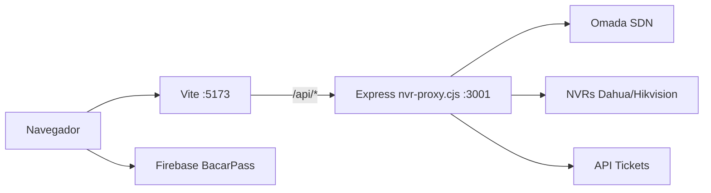

# IT Ops Hub (`appsis`)

Panel web interno para operaciones de IT en Bacar: red Omada, NVR/cámaras, tickets, gastos SaaS, documentación, credenciales BacarPass y directorio de equipo.

**Repositorio:** https://github.com/Sartorifranco/appsis

---

## Arquitectura



| Componente | Carpeta / archivo | Puerto | Comando |
|------------|-------------------|--------|---------|
| Frontend (React + Vite) | raíz del repo | **5173** | `npm run dev` |
| Proxy API (NVR, Omada, tickets) | `server/nvr-proxy.cjs` | **3001** | `cd server && npm start` |
| Cloud Functions (opcional) | `functions/` | — | ver [Functions](#cloud-functions-opcional) |

> **Importante:** sin el proxy en **3001**, la UI carga pero fallan dashboard Omada, cámaras/NVR y tickets (Vite reenvía `/api/*` a localhost:3001).

---

## Requisitos

- **Node.js** 18 o superior (recomendado LTS)
- **npm** (incluido con Node)
- Acceso a la **red interna** (Omada, NVRs, API de tickets suelen estar en IPs privadas)
- Cuenta Firebase del proyecto **legajosonline-959f6** (BacarPass) para Auth/Firestore/Storage
- Archivo **`.env`** completo (pedirlo por canal seguro a quien mantenga el entorno; no está en Git)
- JSON de **Service Account** en `secrets/` (para scripts admin; ver abajo)

---

## Primer arranque (desarrollo)

### 1. Clonar e instalar

```bash
git clone https://github.com/Sartorifranco/appsis.git
cd appsis
npm install
cd server && npm install && cd ..
```

### 2. Variables de entorno

```bash
cp .env.example .env
```

Completar `.env` con los valores reales. Pedir el archivo `.env` ya configurado al responsable del proyecto (contiene URLs, usuarios y contraseñas de NVR, Omada y tickets).

Referencia de variables en [`.env.example`](.env.example) y sección [Variables de entorno](#variables-de-entorno).

### 3. Credenciales Firebase Admin (scripts)

Para `scripts/create-admin-user.cjs` y `scripts/seed-gastos.cjs`:

1. Crear carpeta `secrets/` (no se sube a Git).
2. Copiar ahí el JSON de Service Account de **legajosonline-959f6** con el nombre que esperan los scripts:
   `legajosonline-959f6-firebase-adminsdk-fbsvc-ebe8b1c8ea.json`
3. Pedir ese archivo a IT / al maintainer si no lo tenés.

### 4. Levantar **dos procesos** (orden recomendado)

**Terminal A – proxy:**

```bash
cd server
npm start
# o con recarga: npm run dev
```

**Terminal B – frontend:**

```bash
npm run dev
# si localhost falla en Windows:
npm run dev -- --host 127.0.0.1
```

### 5. Abrir la app

| URL | Uso |
|-----|-----|
| http://127.0.0.1:5173/ | Dashboard (requiere login) |
| http://127.0.0.1:5173/login | Pantalla de ingreso |

---

## Autenticación

- El login usa **Firebase Auth** del proyecto BacarPass (`legajosonline-959f6`), no el Firebase “principal” vacío del `.env`.
- Código: `src/context/AuthContext.tsx`, `src/config/bacarpassFirebase.ts`, `src/modules/Auth/LoginPage.tsx`.
- Tras login exitoso se redirige a `/` (corregido en `LoginPage`).

### Usuario de desarrollo

Si necesitás crear o resetear un usuario de prueba (requiere `secrets/*.json`):

```bash
node scripts/create-admin-user.cjs
# opcional: ITOPS_ADMIN_EMAIL=... ITOPS_ADMIN_PASS=... node scripts/create-admin-user.cjs
```

Por defecto crea `admin@admin.com` / `admin1` (Firebase exige contraseña ≥ 6 caracteres).

### Reglas Firestore y email

> **Estado actual (octubre 2026): fuera de uso.** Las reglas de Firestore de `legajosonline-959f6` son compartidas por todas las apps del proyecto y se administran solo desde el repo de BacarPass (`firestore.rules`). Las colecciones `itops_*` y el acceso a las credenciales de BacarPass están bloqueados. Este repo ya no despliega reglas ni Cloud Functions: su codebase `default` coincidía con el del Libro de Guardia y un deploy podía borrar sus funciones. Para reactivar el IT Ops Hub hay que agregar sus reglas en el repo de BacarPass y darle a las funciones un codebase propio.
>
> Lo que sigue describe cómo funcionaba antes.

Las reglas anteriores solo permitían usuarios con email:

- `*@bacarsa.com.ar`
- `*@bacar.app`
- o emails explícitos en la lista (`sistemas.TI@bacarsa.com.ar`, etc.)

**Consecuencia:** podés iniciar sesión con `admin@admin.com`, pero **Gastos, Docs, Equipo y BacarPass** darán error de permisos en Firestore hasta que:

- uses una cuenta `@bacarsa.com.ar`, **o**
- ampliés las reglas (y despliegues con `firebase deploy --only firestore:rules`).

### Colección `itops_equipo`

El módulo **Directorio de equipo** usa `itops_equipo`. La regla ya está en [`firestore.rules`](firestore.rules); hay que **desplegarla** en Firebase:

```bash
firebase deploy --only firestore:rules
```

---

## Módulos y rutas

| Ruta | Módulo | Fuente de datos |
|------|--------|-----------------|
| `/` | Dashboard Omada + widgets | Proxy `/api/omada/*`, Firestore gastos/tickets |
| `/camaras` | NVR y ping de IPs | Proxy `/api/nvr/*`, `VITE_CAMERA_IPS` |
| `/docs` | Documentación + archivos | Firestore `itops_docs`, `itops_archivos`; Storage `it-ops/files/` |
| `/gastos` | Suscripciones SaaS | Firestore `itops_gastos` |
| `/tickets` | Sistema de tickets | Proxy `/api/tickets-proxy/*` → `TICKETS_API_URL` |
| `/credenciales` | Vault BacarPass | Firestore `artifacts/.../passwords` o Cloud Function |
| `/equipo` | Directorio interno | Firestore `itops_equipo` |

Rutas definidas en [`src/App.tsx`](src/App.tsx). Sidebar en [`src/components/Sidebar.tsx`](src/components/Sidebar.tsx).

---

## Estructura del proyecto

```
appsis/
├── src/                    # Frontend React + TypeScript
│   ├── modules/            # Páginas por dominio (Auth, Infra, Camaras, …)
│   ├── services/           # Llamadas API (omada, nvr, tickets)
│   ├── hooks/              # useOmada, useGastosSaaS, useEquipo, …
│   ├── context/            # AuthContext
│   └── config/             # Firebase / BacarPass
├── server/
│   └── nvr-proxy.cjs       # Proxy Express (lee ../.env)
├── functions/              # Cloud Functions (BacarPass credentials)
├── scripts/                # Utilidades (admin user, seed gastos)
├── secrets/                # Service Account (gitignored)
├── firestore.rules
├── storage.rules
├── firebase.json
├── vite.config.ts          # Proxy dev /api → :3001
└── .env.example
```

Alias de imports: `@/` → `src/` (ver `vite.config.ts` y `tsconfig`).

---

## Variables de entorno

Archivo único: **`.env` en la raíz**. El proxy (`server/nvr-proxy.cjs`) lo carga con `dotenv` desde `../.env`.

### Frontend (prefijo `VITE_`)

| Variable | Descripción |
|----------|-------------|
| `VITE_BACARPASS_*` | Proyecto Firebase usado para login, Firestore y Storage |
| `VITE_FIREBASE_*` | Firebase “hub” alternativo (opcional; hoy no es el de login) |
| `VITE_CAMERA_IPS` | IPs de cámaras para ping (coma-separadas) |
| `VITE_CAMERA_CHECK_PORT` | Puerto TCP para comprobar si responde (default 80) |
| `VITE_OMADA_*` | Referencia cliente; la integración real va por proxy |
| `VITE_CREDENTIALS_API_*` | API externa opcional de credenciales |

### Proxy (solo servidor – nunca exponer al browser)

| Variable | Descripción |
|----------|-------------|
| `NVR_PROXY_PORT` | Puerto del proxy (default **3001**) |
| `NVR_N_NAME`, `NVR_N_BASE_URL`, `NVR_N_USERNAME`, `NVR_N_PASSWORD`, `NVR_N_BRAND`, `NVR_N_CHANNELS` | NVR 1…7 (`dahua` \| `hikvision`; canales `1-48`, etc.) |
| `OMADA_URL`, `OMADA_USER`, `OMADA_PASS`, `OMADA_SITE_ID` | Controlador Omada SDN |
| `TICKETS_API_URL`, `TICKETS_ADMIN_EMAIL`, `TICKETS_ADMIN_PASS` | Backend de tickets + credenciales admin para JWT |

---

## API del proxy local (`server/nvr-proxy.cjs`)

Base: `http://localhost:3001` (en dev el browser usa `/api/...` vía Vite).

### NVR

| Método | Ruta | Descripción |
|--------|------|-------------|
| GET | `/api/nvrs` | Lista de NVRs configurados |
| GET | `/api/nvr/all/status` | Estado de todos los NVRs |
| GET | `/api/nvr/:id/status` | HDD + canales de un NVR |
| GET | `/api/nvr/:id/recording` | Estado de grabación |
| GET | `/api/nvr/:id/hdd` | Discos |
| GET | `/api/nvr/:id/health` | Health check |

### Omada

| Método | Ruta | Descripción |
|--------|------|-------------|
| GET | `/api/omada/health` | Conectividad y site ID |
| GET | `/api/omada/devices` | Dispositivos del sitio |
| GET | `/api/omada/devices/full` | Dispositivos con CPU, radios, etc. |
| GET | `/api/omada/clients` | Clientes conectados |
| GET | `/api/omada/switch/:mac/ports` | Puertos de un switch |
| GET | `/api/omada/probe` | Diagnóstico de URL/puertos |

### Tickets

| Método | Ruta | Descripción |
|--------|------|-------------|
| GET | `/api/tickets-proxy/tickets` | Lista (query string de filtros) |
| GET | `/api/tickets-proxy/dashboard` | Métricas admin |
| PUT | `/api/tickets-proxy/tickets/:id/status` | Cambiar estado |
| PUT | `/api/tickets-proxy/tickets/:id/reassign` | Reasignar |
| GET | `/api/tickets-proxy/health` | Verificar JWT |

---

## Firebase / Firestore

**Proyecto:** `legajosonline-959f6` (BacarPass)

| Colección | Uso |
|-----------|-----|
| `itops_gastos` | Módulo Finanzas |
| `itops_docs` | Documentación markdown |
| `itops_archivos` | Metadata de archivos subidos |
| `itops_equipo` | Directorio de equipo |
| `artifacts/bacarpass-v1/public/data/passwords` | Credenciales BacarPass (solo lectura cliente) |

Storage: archivos en `it-ops/files/` (reglas en [`storage.rules`](storage.rules)).

Desplegar reglas:

```bash
firebase login
firebase use legajosonline-959f6   # o el alias configurado
firebase deploy --only firestore:rules,storage
```

---

## Scripts útiles

```bash
# Crear / resetear usuario Firebase Auth (dev)
node scripts/create-admin-user.cjs

# Cargar gastos de ejemplo en itops_gastos
node scripts/seed-gastos.cjs

# Lint y build frontend
npm run lint
npm run build
npm run preview    # preview del build estático
```

---

## Cloud Functions (opcional)

Solo si trabajás en credenciales vía función callable `getBacarPassCredentials`.

Ver [`functions/README.md`](functions/README.md). Requiere Firebase CLI, secreto `BACARPASS_SERVICE_ACCOUNT_JSON` y:

```bash
cd functions
npm install
npm run build
firebase deploy --only functions
```

---

## Producción (notas)

- `npm run build` genera la SPA en `dist/`.
- El proxy **no** se empaqueta con Vite: en producción hay que servir `dist/` y exponer el mismo backend (o equivalente) en el host que corresponda.
- No commitear `.env`, `secrets/` ni JSON de service accounts.

---

## Solución de problemas

| Síntoma | Causa probable | Qué hacer |
|---------|----------------|-----------|
| Error 503 en `/api/*` | Proxy no corre | `cd server && npm start` |
| `localhost:5173` no abre | Vite apagado | `npm run dev -- --host 127.0.0.1` |
| Login carga y queda en `/login` | Bug corregido: falta redirect | Actualizar código; usar `127.0.0.1:5173/login` |
| Omada vacío / 502 | `OMADA_*` mal o sin red VPN | Revisar `.env` y consola del proxy |
| NVR sin datos | IP inaccesible desde la PC del dev | Estar en la red correcta; revisar `NVR_N_*` |
| Firestore “permission denied” | Email no autorizado en reglas | Usar `@bacarsa.com.ar` o actualizar `firestore.rules` |
| Equipo no guarda | Reglas no desplegadas o email no autorizado | `firebase deploy --only firestore:rules`; usar `@bacarsa.com.ar` |

Logs útiles: terminal del proxy (`[Omada]`, `[Tickets]`, errores NVR) y consola del browser (F12).

---

## Checklist de handoff (para quien continúa el desarrollo)

- [ ] Clonar repo y tener `.env` completo (canal seguro, no Git)
- [ ] Tener JSON de Service Account en `secrets/`
- [ ] `npm install` en raíz y en `server/`
- [ ] Proxy + Vite corriendo; probar login con cuenta corporativa
- [ ] Confirmar acceso VPN/red a Omada, NVRs y tickets
- [ ] Desplegar reglas Firestore (`firebase deploy --only firestore:rules`)
- [ ] Leer `src/types/index.ts` para modelos de datos
- [ ] Contacto IT: `sistemas.TI@bacarsa.com.ar`

---

## Contacto

Dudas de acceso, `.env` o credenciales de infraestructura: **sistemas.TI@bacarsa.com.ar**.
